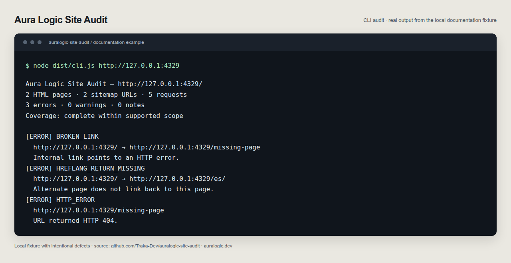
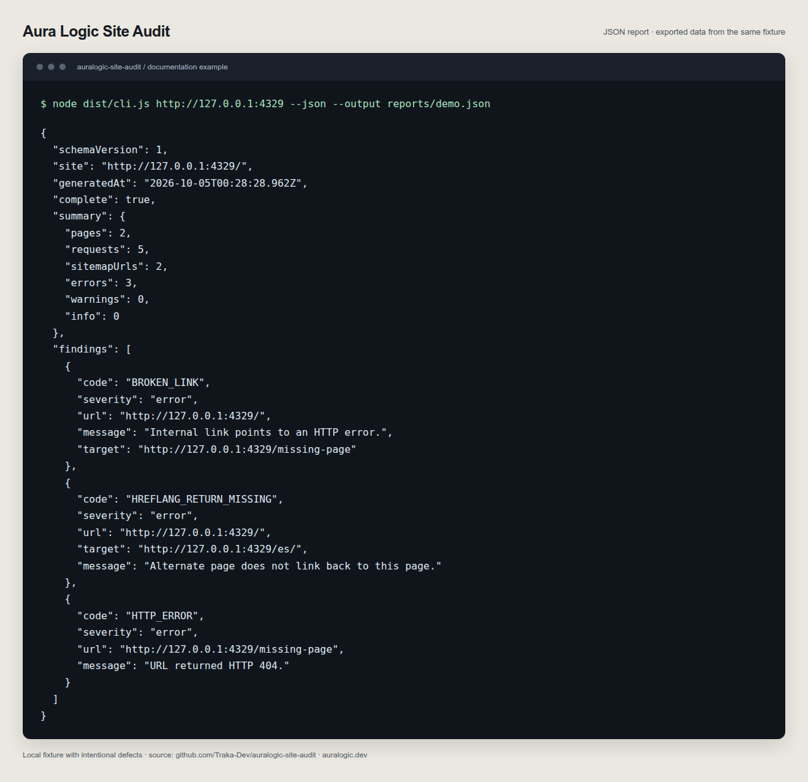

# Aura Logic Site Audit

Auditor open source de sitemaps XML, canonical en HTML, hreflang en HTML y enlaces internos rotos. Primera versión en desarrollo; todavía no está publicado en npm ni tiene demo web.

Creado por [Aura Logic](https://auralogic.dev/).

## Empezar

Requiere Node.js 24 LTS o Node.js 22.22.1+.

```bash
git clone https://github.com/Traka-Dev/auralogic-site-audit.git
cd auralogic-site-audit
npm ci
npm run build
node dist/cli.js https://example.com
node dist/cli.js https://example.com --json --output reports/audit.json
```

Descubre el sitemap desde `robots.txt` y rastrea enlaces del mismo origen. Cada hallazgo incluye código, gravedad, URL, explicación y, cuando corresponde, URL de destino.

Respeta `robots.txt`, limita las peticiones y marca los informes incompletos. No verifica enlaces externos ni ejecuta JavaScript. Tampoco comprueba la indexación real de Google. Consulta el [alcance](checks.md) antes de interpretar resultados.

## Ejemplo visual

Las imágenes muestran salida real de la CLI, presentada para documentación. La demo local incluye un enlace roto y una anotación hreflang de retorno ausente de manera intencional.

En una terminal, inicia la demo:

```bash
node examples/demo-site.mjs
```

En otra terminal, ejecuta:

```bash
node dist/cli.js http://127.0.0.1:4329
node dist/cli.js http://127.0.0.1:4329 --json --output reports/demo.json
```

Ambos comandos terminan con código `1` por los errores del ejemplo. El segundo guarda el informe sin imprimirlo en stdout. Detén la demo con `Ctrl+C` al terminar.





## Contribuir

```bash
npm run check
npm run test:watch
```

Husky valida los archivos preparados para commit, commitlint exige Conventional Commits y el hook de push ejecuta los checks. Las contribuciones deben incluir evidencia o una prueba que reproduzca el problema. Consulta [CONTRIBUTING.md](../CONTRIBUTING.md).

## Kit de reparación con IA

La [guía de trabajo](ai-workflow.md) incluye prompts para [clasificar](../prompts/triage.md), [corregir](../prompts/repair.md) y [verificar](../prompts/verify.md), junto con instrucciones opcionales para [Codex](../setup/AGENTS.example.md) y [Claude Code](../setup/CLAUDE.example.md). Pide respuestas en español. Revisa e integra los ejemplos sin sobrescribir las instrucciones existentes; no se instala ninguna integración de IA.

Consulta el [tutorial de Astro](https://auralogic.dev/es/insights/auditar-hreflang-canonical-astro/) y la [página del auditor](https://auralogic.dev/es/herramientas/auditor-seo/).
